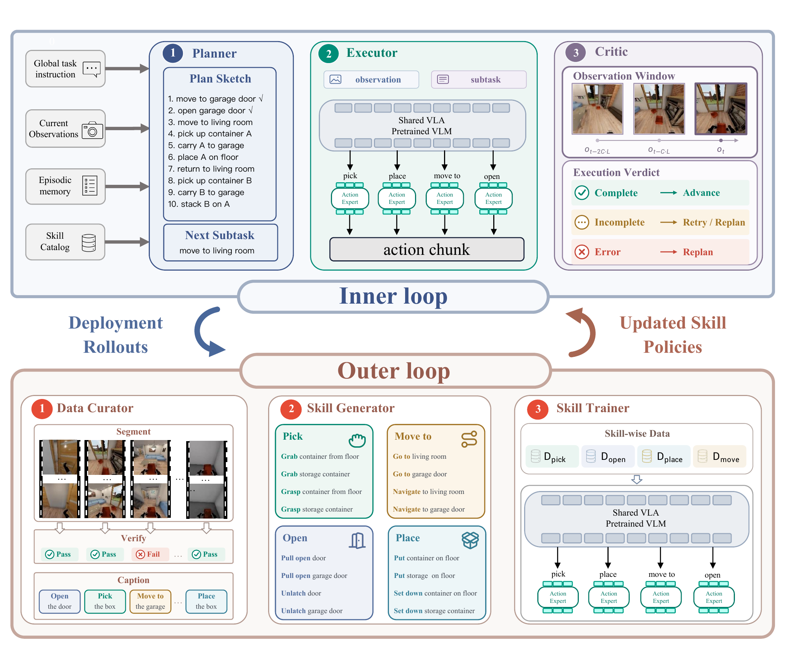

<div align="center">

# MobiAgent: From Execution to Evolution
### A Dual-Loop Agentic System for Long-Horizon Mobile Manipulation

[Chenzhi Liu](https://openreview.net/profile?id=~Chenzhi_Liu2)<sup>1,*</sup> · [Zhang Yue](https://openreview.net/profile?id=~Zhang_Yue_bolt1)<sup>1,*</sup> · [Jiehong Lin](https://openreview.net/profile?id=~Jiehong_Lin1)<sup>1,*,†</sup> · [Jianan Wang](https://openreview.net/profile?id=~Jianan_Wang2)<sup>2</sup><br>
[Bo Wang](https://openreview.net/profile?id=~Bo_Wang36)<sup>1</sup> · [Zhongrui Wang](https://openreview.net/profile?id=~Zhongrui_Wang1)<sup>3,‡</sup> · [Xiaojuan Qi](https://openreview.net/profile?id=~Xiaojuan_Qi4)<sup>1,‡</sup>

<sup>1</sup> The University of Hong Kong &nbsp; <sup>2</sup> Astribot &nbsp; <sup>3</sup> Southern University of Science and Technology<br>
<sup>*</sup> Equal contribution &nbsp; <sup>†</sup> Project leader &nbsp; <sup>‡</sup> Corresponding authors

[](docs/overview.md)
[](#paper)
[](docs/robocasa.md)
[](docs/deployment.md)
[](docs/release-scope.md)



</div>

MobiAgent connects a deployment loop of **planning, skill execution, and visual reflection** with an offline loop of **demonstration processing, skill discovery, and policy training**. A shared vision-language backbone supports multiple flow-matching action experts.

This repository is a **private code preview**. It contains curated source code and documentation, with no experiment results, logs, datasets, trained weights, or credentials. The cleaned runtime and portable recipes are not a claim of exact reproduction of the paper's reported experiments. See [release scope and validation](docs/release-scope.md).

## Paper

The paper link will be added here when available.

## Repository layout

```text
scripts/
  robocasa/           RoboCasa entrypoints: infer, serve, train, train_joint
  data/               Demonstration segmentation and per-expert data splitting
configs/
  robocasa/           RoboCasa dataset and policy-server templates
src/mobiagent/
  execution/          Shared planner, skill routing, visual critic and control loop
  environments/       RoboCasa simulator adapter
  discovery/behavior/ BEHAVIOR offline skill discovery
policy/openpi/
  src/openpi/         Shared model, policy serving and training implementation
  scripts/            BEHAVIOR training, serving and preprocessing entrypoints
docs/                 RoboCasa workflow, BEHAVIOR setup and architecture
```

| Workflow | Entry point | Guide |
| --- | --- | --- |
| RoboCasa inference | [`scripts/robocasa/infer.py`](scripts/robocasa/infer.py) | [Inference setup](docs/robocasa.md#inference) |
| RoboCasa policy server | [`scripts/robocasa/serve.py`](scripts/robocasa/serve.py) | [Serving a checkpoint](docs/robocasa.md#inference) |
| RoboCasa training · frozen VLM | [`scripts/robocasa/train.py`](scripts/robocasa/train.py) | [Training setup](docs/robocasa.md#training) |
| RoboCasa joint training | [`scripts/robocasa/train_joint.py`](scripts/robocasa/train_joint.py) | [Training setup](docs/robocasa.md#training) |
| BEHAVIOR execution and training | [`src/mobiagent/execution/`](src/mobiagent/execution/) · [`policy/openpi/scripts/`](policy/openpi/scripts/) | [Deployment](docs/deployment.md) · [Training](docs/training.md) |
| Offline skill discovery | [`src/mobiagent/discovery/behavior/`](src/mobiagent/discovery/behavior/) | [Data preparation](docs/data.md) |

## Quick start

Python 3.11 or later is required. The lightweight agent and the GPU policy backend
can run in separate environments.

```bash
python -m venv .venv
source .venv/bin/activate
pip install -e .
pip install -e policy/openpi/packages/openpi-client
cp configs/policy_servers.example.yaml configs/policy_servers.yaml
```

Run the agent loop with mock planning, policies and observations, without a GPU,
robot, dataset, or model API call:

```bash
mobiagent --env mock --mock-all --task example \
  --instruction 'Move an object into a container' --max-ticks 3
```

For live planning and reflection, export your own `AZURE_OPENAI_API_KEY`,
`AZURE_OPENAI_ENDPOINT`, and `AZURE_OPENAI_DEPLOYMENT`. The `.env.example` file
lists supported settings; it is a template, not automatically loaded.

- [BEHAVIOR and RoboCasa deployment](docs/deployment.md)
- [Offline skill discovery and data preparation](docs/data.md)
- [Policy training and serving](docs/training.md)
- [RoboCasa inference and training](docs/robocasa.md)

## Citation

Citation details will be added here when the final reference is available.

## Acknowledgments

The work has been supported by Hong Kong Research Grant Council - General Research Fund Scheme (Grant No. 17202422, 17212923, 17215025) Theme-based Research (Grant No.T45-701/22-R), and Strategic Topics Grant (Grant No.STG3/E-605/25-N). Part of the described research work is conducted in the JC STEM Lab of Robotics for Soft Materials funded by The Hong Kong Jockey Club Charities Trust.

## License and release status

First-party code remains a private research preview; no public open-source license
has been selected yet. Third-party license notices are retained under
[`policy/openpi/`](policy/openpi/) and summarized in [NOTICE.md](NOTICE.md).
